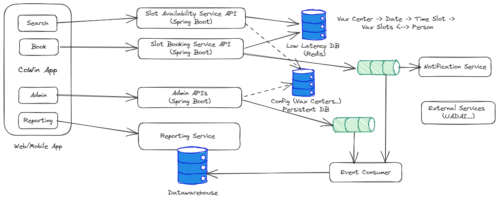

# CoWin 

This project develop a basic working component of required to develop India's famous Cowin application. Objective of this application is to develop core APIs and demonstrate capabilities required and potential challenges.


## Requirements

### Use Cases

1. Search for Available Slots : Finds available slots for given location and date
2. Reserve a slot for the given location, date and user. Once booked user needs to be notified and available slots to be decremented
3. Admin - Register Vax centers, add/modify slots
4. View number of bookings per day across vax centers, Generate drill-down reports

### Non-functional Requirements

1. Scale for 3000 requests per second
2. Latency <30 ms
3. Application state needs to be consistent
4. A single user should not be allowed more than 1 booking
5. Application needs to be secured

## Architecture

### Application Architecture

Key functionality of this application is ability to search and book a slot. It is expected as slots open up at certain time during the day, burst of user requests are expected and slot booking needs to be fair and quick.

A live dashboard and constantly updated available number of slots needs to be transparently available to the users. Once successfully booked, users can be notified through sms/whatsapp.



### API Documentation

Following APIs would be implemented as designed part of this exercise :

[APIs to build using OpenAPI Specs](https://documenter.getpostman.com/view/28972773/2s9XxyRtkk)


 


## How to Build and Run?


Code is developed using java and build using Maven. Docker containers can be built and can be run.

### Build Project

Clone porject from git (https://github.com/souravt/cowin-backend) and then build project using Maven. Java (>17) and Maven needs to be installed.

```
mvn clean install
```


### Build Docker Container

Run following command from project root folder to build docker container .

``` 
docker build . --tag cowin-api
```

### Run Container

Run following command from project root folder to build docker container :

```
docker run -p 9091:9091 --name cowin-api cowin-api 
```

Run a curl command to test :

```
curl http://localhost:9091/ping
```

One should receive a response "Pong". Bingo!

### Tasks
- [x] Setup Environment (Source Control, IDE, Build, Project Scaffolding)
- [x] Design APIs using OpenAPI
- [x] Develop working APIs for registration, search for available slots and slot booking
- [x] Build, Deploy and Run 
- [x] Build performance test suit to benchmark performance
- [] Isolate services to scale
- [] Redis and messaging integration
- [] Messaging integration
- [] Add Authentication
- [x] Logging
- [] Error handling
- [] Notification confirmation

 


