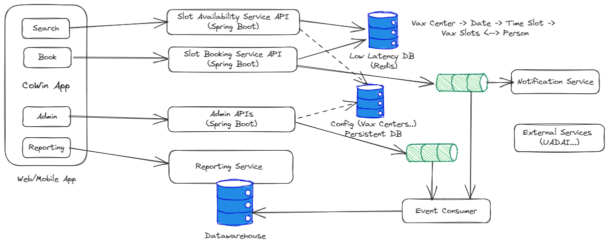
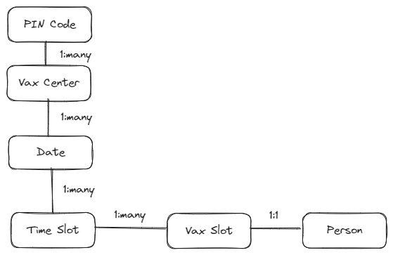
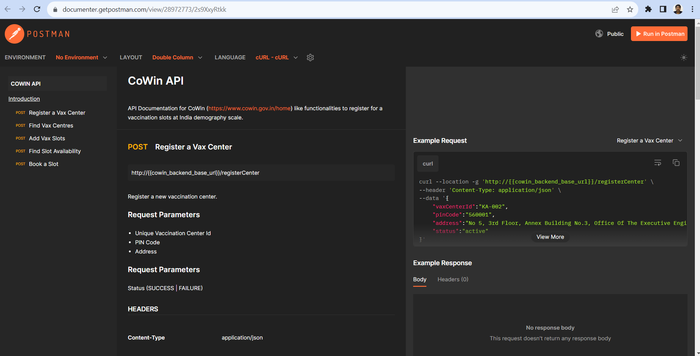
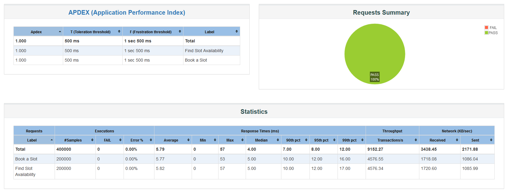

# CoWin 

This project develop a basic working component of required to develop India's famous Cowin application. Objective of this application is to develop core APIs and demonstrate capabilities required and potential challenges.


## Requirements

### Use Cases

1. Search for Available Slots : Finds available slots for given location and date
2. Reserve a slot for the given location, date and user. Once booked user needs to be notified and available slots to be decremented
3. Admin - Register Vax centers, add/modify slots
4. View number of bookings per day across vax centers, Generate drill-down reports

### Non-functional Requirements

1. Scale for 3000 requests per second
2. Latency <30 ms
3. Application state needs to be consistent
4. A single user should not be allowed more than 1 booking
5. Application needs to be secured

## Architecture

### Application Architecture

Key functionality of this application is ability to search and book a slot. It is expected as slots open up at certain time during the day, burst of user requests are expected and slot booking needs to be fair and quick.

A live dashboard and constantly updated available number of slots needs to be transparently available to the users. Once successfully booked, users can be notified through sms/whatsapp.




### Data Architecture

Logic data model consists of few entities with ability to assign vaccination slots for given vax center, date/time and ability for a person to book or cancel.



 
### Solution Design Decisions


| Sl No	   | Decision | Rationale | Alternatives | Notes |
| -------- | -------  | -------   | -------      | ------- |
| 1		   | Language - Java   | Easy to start , enterprise grade| Python, Golang, NodeJs | |
| 2		   | Microservice, EDA as architecture patterns | Horizontal Scalability| Monolith | |
| 3		   | Redis as In-Memory database | Distributed cache, Low latency, fast , high throughput| RDBMS, NoSQL | Data needs to be persisted |


### API Documentation

Following APIs would be implemented as designed part of this exercise :

[APIs to build using OpenAPI Specs](https://documenter.getpostman.com/view/28972773/2s9XxyRtkk)

Note : API URI pattern is designed for readibility than resource, follows more of [this pattern](https://cloud.google.com/apis/design/naming_convention)




## How to Build and Run?


Code is developed using java and build using Maven. Docker containers can be built and can be run.

### Build Project

Clone project from git (https://github.com/souravt/cowin-backend) and then build project using Maven. Java (>17) and Maven needs to be installed.

```
mvn clean install
```


### Build Docker Container

Run following command from project root folder to build docker container .

``` 
docker build . --tag cowin-api
```

### Run Container

Run following command from project root folder to build docker container :

```
docker run -p 9091:9091 --cpu-period=50000 --cpu-quota=25000 --memory=1024m --name cowin-api cowin-api 
```

Run a curl command to test :

```
curl http://localhost:9091/ping
```

One should receive a response "Pong". Bingo!

## Tasks
- [x] Setup Environment (Source Control, IDE, Build, Project Scaffolding)
- [x] Design APIs using OpenAPI
- [x] Develop working APIs for registration, search for available slots and slot booking
- [x] Build, Deploy and Run 
- [x] Build performance test suit to benchmark performance
- [] Redis integration
- [] Messaging integration
- [] Add Authentication
- [x] Logging
- [] Error handling
- [] Notification confirmation
- [] Isolate services to scale


## Performance Test

While developing this application and ensuring basics like unit testing, static code analysis and consistent application architecture, once of the most crucial aspect is ability to scale and perform without any performance degradation.

A performance test suite using JMeter is designed up-front for continuous validation.

Test Script  : 

### Goals :

1. Zero server internal error (except of building back pressure)
2. Response time 99% percentile <50 milliseconds
3. Ability to horizontally scale

### Scaling to 4500 Transactions per second

Transaction/s : 4576
Response Time (Avg): 5.8 ms
Errors : None
CPU : 0.28%
Memory: 422 MB





 


 


